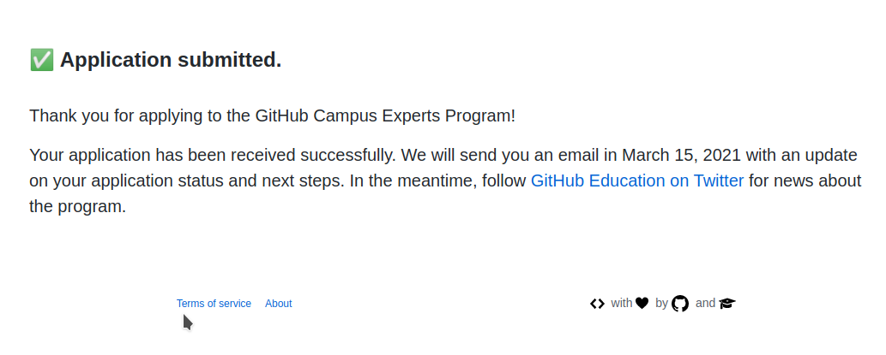
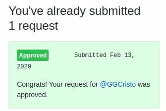
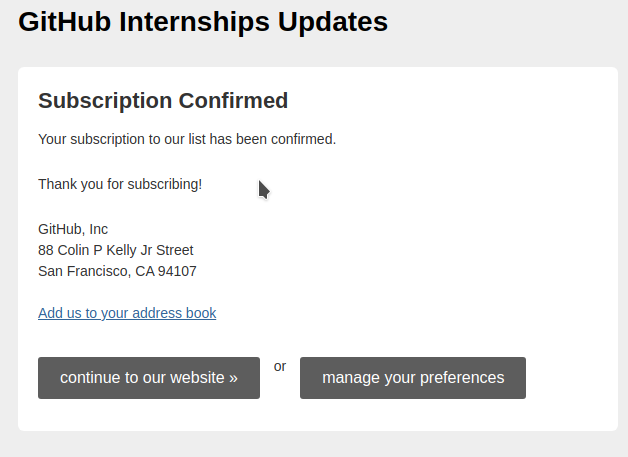

## Tareas
- __Realice el curso Become a Campus Expert__
```
Cuestionario rellenado sin problema
```

- __Solicite su Student Developer Pack__
```
Ya había solicitado este pack y he gozado de algunos servicios
como un Travis más rápido y que funciona con repostitorios
privados y Coverralls en repostitorios privados
```

- __Solicite una Github Intership__
```
Las solicitudes estaban cerradas, así que me suscribí a la lísta a la espera de noticias
```


URL de GitHubPages:\
https://ull-esit-pl-2021.github.io/github-campus-expert-cristo-garcia-gonzalez-alu0101204512/
